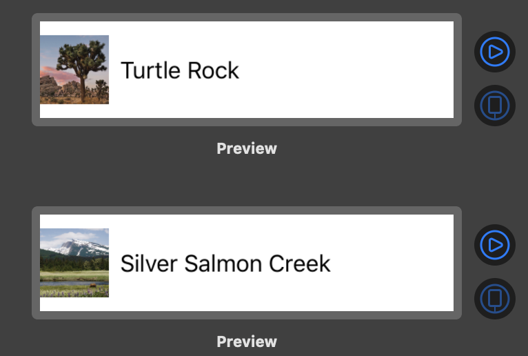
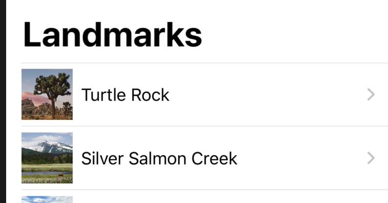
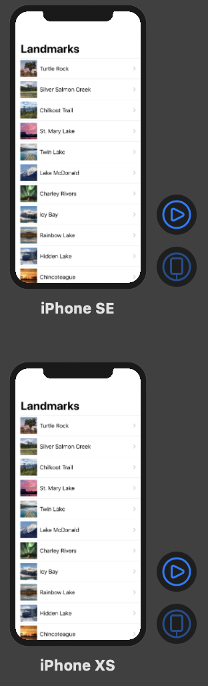

# Building Lists and Navigation

- Get to Know the Sample Data

    샘플 데이터 모델 생성하기

    ```json
    // landmarkData.json
    [
        {
            "name": "Turtle Rock",
            "category": "Featured",
            "city": "Twentynine Palms",
            "state": "California",
            "id": 1001,
            "park": "Joshua Tree National Park",
            "coordinates": {
                "longitude": -116.166868,
                "latitude": 34.011286
            },
            "imageName": "turtlerock"
        },
    	...
    ]
    ```

    ```swift
    import CoreLocation
    import SwiftUI

    struct Landmark: Codable {
        var name: String
        var category: Category
        var city: String
        var state: String
        var id: Int
        var park: String
        var coordinates: Coordinates
        var imageName: String
        var locationCoordinate: CLLocationCoordinate2D {
            return CLLocationCoordinate2D(latitude: coordinates.latitude, longitude: coordinates.longitude)
        }
        
        struct Coordinates: Codable {
            var latitude: Double
            var longitude: Double
        }
        
        enum Category: String, Codable {
            case featured = "Featured"
            case lakes = "Lakes"
            case rivers = "Rivers"
        }
    }
    ```

- Create the Row View

    json 데이터의 첫번째 아이템으로 row 구성

    ```swift
    import SwiftUI

    struct LandmarkRow: View {
        var landmark: Landmark
        var body: some View {
            HStack {
                landmark.image
                    .resizable()
                    .frame(width: 50, height: 50)
                Text(landmark.name)
                Spacer()
            }
        }
    }

    struct LandmarkRow_Previews: PreviewProvider {
        static var previews: some View {
            LandmarkRow(landmark: landmarkData[0])
        }
    }
    ```

- Customize the Row Preview

    Xcode의 캔버스는 PreviewProvider 프로토콜을 준수하는 것들을 자동 인식하여 표시한다

    PreviewProvider는 크기, 디바이스를 구성하는 옵션을 포함한 하나 이상의 뷰를 리턴한다

    → PreviewProvider에서 리턴되는 뷰를 커스텀하게 렌더링 가능

    ```swift
    struct LandmarkRow_Previews: PreviewProvider {
        static var previews: some View {
            Group {
                LandmarkRow(landmark: landmarkData[0])
    //                .previewLayout(.fixed(width: 300, height: 70))
                LandmarkRow(landmark: landmarkData[1])
    //                .previewLayout(.fixed(width: 300, height: 70))
            }.previewLayout(.fixed(width: 300, height: 70))
        }
    }
    ```

    

- Create the List of Landmarks

    위에서 만든 Row로 정적 리스트 만들기

    ```swift
    import SwiftUI

    struct LandmarkList: View {
        var body: some View {
            List {
                LandmarkRow(landmark: landmarkData[0])
                LandmarkRow(landmark: landmarkData[1])
            }
        }
    }

    struct LandmarkList_Previews: PreviewProvider {
        static var previews: some View {
            LandmarkList()
        }
    }
    ```

- Make the List Dynamic
    - 데이터 Collection을 가져와서 각 element를 뷰에 넣어준다
    - 리스트는 Identifiable 프로토콜 또는 그것을 대체할 id 값을 지정해 주어야 한다
    1. 아래 예시는 id값을 지정한 경우

        ```swift
        var body: some View {
        //        List {
        //            LandmarkRow(landmark: landmarkData[0])
        //            LandmarkRow(landmark: landmarkData[1])
        //        }
                List(landmarkData, id: \.id) { landmark in
                    LandmarkRow(landmark: landmark)
                }
            }
        ```

    2. Identifiable 프로토콜 사용한 경우 (이게 더 나은듯)

        ```swift
        struct Landmark: Codable, Hashable, Identifiable { }

        struct LandmarkList: View {
            var body: some View {
                List(landmarkData) { landmark in
                    LandmarkRow(landmark: landmark)
                }
            }
        }
        ```

    - Set up Navigation between 'List' and 'Detail'

        LandmarkList의 row를 클릭하면 LandmarkDetail 뷰로 이동하기 구현

        ```swift
        struct LandmarkList: View {
            var body: some View {
                NavigationView {
                    List(landmarkData) { landmark in
                        NavigationLink(destination: LandmarkDetail()) {
                            LandmarkRow(landmark: landmark)
                        }
                        
                    }
                    .navigationBarTitle(Text("Landmarks")) // 위치 여기..
                }
            }
        }
        ```

        

    - Pass Data into Child Views

        하드 코딩된 부분 수정하기.

        ```swift
        import SwiftUI

        struct LandmarkDetail: View {
            var landmark: Landmark // 추가
            
            var body: some View {
                VStack {
                    MapView(coordinate: landmark.locationCoordinate) // 수정
                        .edgesIgnoringSafeArea(.top)
                        .frame(height: 300) 
                    
                    CircleImage(image: landmark.image) // 수정
                        .offset(y: -130)
                        .padding(.bottom, -130)
                    
                    VStack(alignment: .leading) {
                        Text(landmark.name) // 수정
                            .font(.title)
                        HStack {
                            Text(landmark.park) // 수정
                                .font(.subheadline)
                            Spacer()
                            Text(landmark.state) // 수정
                            .font(.subheadline)
                        }
                    }
                    .padding()
                    Spacer()
                }
                .navigationBarTitle(Text(landmark.name), displayMode: .inline) // 수정
            }
        }

        struct LandmarkDetail_Previews: PreviewProvider {
            static var previews: some View {
                LandmarkDetail(landmark: landmarkData[0])
            }
        }
        ```

        앱은 SceneDelegate에 정의된 루트 뷰로 시작한다.

        ```swift
        func scene(_ scene: UIScene,
         willConnectTo session: UISceneSession,
         options connectionOptions: UIScene.ConnectionOptions) {
         
                if let windowScene = scene as? UIWindowScene {
                    let window = UIWindow(windowScene: windowScene)
                    window.rootViewController = UIHostingController(rootView: LandmarkList())
                    self.window = window
                    window.makeKeyAndVisible()
                }
        }
        ```

    - Generating Previews Dynamically

        Preview에 표시되는 디바이스 설정하기

        ```swift
        struct LandmarkList_Previews: PreviewProvider {
            static var previews: some View {
        // 아이폰SE 사이즈로 렌더링
        //        LandmarkList()
        //        .previewDevice(PreviewDevice(rawValue: "iPhone SE"))
                
                ForEach(["iPhone SE", "iPhone XS Max"], id: \.self) { deviceName in
                    LandmarkList()
                    .previewDevice(PreviewDevice(rawValue: deviceName))
                    .previewDisplayName(deviceName)
                }
            }
        }
        ```

        
